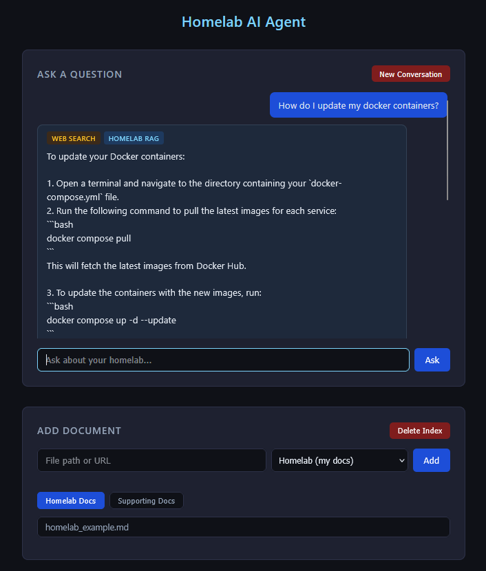

# Homelab AI Agent

A personal project built for two reasons: to have a useful AI assistant for my own homelab setup, and to learn more about how LLMs work in practice — routing, retrieval, tool use, and conversation memory.

The agent can answer questions about my specific homelab by searching my own documentation, look up general product information from manuals and guides I've indexed, search the web via Tavily when needed, and suggest commands I can run directly.

Runs entirely on your machine using [Ollama](https://ollama.com) for local LLM inference. No API costs, no data leaving your network.



## How it works

1. Documents are chunked and indexed into a persistent local vector database (ChromaDB)
2. When a question is asked, a router LLM call decides which tools to use
3. The selected tools retrieve relevant context (local docs, web search, or both)
4. A second LLM call generates an answer grounded in that context
5. Conversation history is maintained so follow-up questions work naturally

## Two document collections

- **Homelab** — personal documentation specific to my setup (hardware, services, configs, IPs)
- **Supporting** — general reference material (product manuals, software guides, external docs)

The agent keeps these separate so it knows what's my actual setup vs. general knowledge.

## Requirements

- Python 3.10+
- [Ollama](https://ollama.com) installed and running with `llama3.2` pulled
- A [Tavily](https://tavily.com) API key for web search

## Installation

Clone the repo and install dependencies:

```bash
git clone https://github.com/yourusername/homelab-ai-agent.git
cd homelab-ai-agent
pip install requests beautifulsoup4 chromadb ollama flask pdfplumber python-dotenv tavily-python
```

Pull the model:

```bash
ollama pull llama3.2
```

Create a `.env` file in the project root:

```
TAVILY_API_KEY=your_key_here
```

## Start Application

```bash
python app.py
```

Then open `http://localhost:5000` in your browser.

## Usage

### Ask a Question

Type any question into the chat. The agent routes it to the appropriate tools, retrieves context, and answers based on what it finds. Tool badges on each response show which sources were used. If a command is suggested, it appears in a copyable block with the agent's reasoning.

Use **New Conversation** to clear the chat history and start fresh.

### Add Document

Enter a file path or URL and select which collection to add it to. Supported sources:

| Type | Example |
|---|---|
| Local markdown / text | `./homelab.md` |
| Local PDF | `./proxmox-guide.pdf` |
| Web page | `https://docs.docker.com/get-started/` |
| PDF URL | `https://example.com/manual.pdf` |
| Batch list (`.txt`) | `./sources.txt` |

**Batch ingestion:** Create a `.txt` file with one source per line. Entering it in the Add Document field ingests each item individually. Failures are reported per-item without stopping the rest.

```
./homelab.md
https://tailscale.com/kb/
./proxmox-guide.pdf
```

### Managing the Index

- Use the **Homelab Docs / Supporting Docs** tabs to see what's indexed in each collection
- **Delete Index** wipes everything and resets both collections

## Command Line

Documents can also be ingested directly:

```bash
python Core/embeddings.py ./homelab.md homelab
python Core/embeddings.py https://docs.home-assistant.io/ supporting
```
